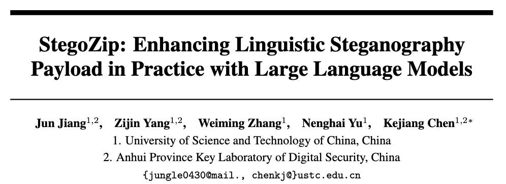
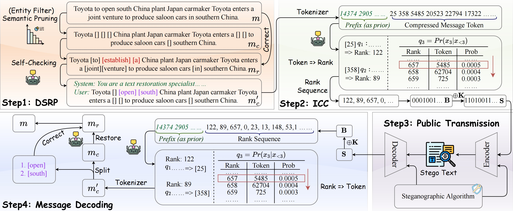

# StegoZip: Enhancing Linguistic Steganography Payload in Practice with Large Language Models



This repository hosts the official PyTorch implementation of the paper: "[StegoZip: Enhancing Linguistic Steganography Payload in Practice with Large Language Models](https://openreview.net/forum?id=JJ29N4MklH)" (Accepted by Neurips 2025).

## Overview.


Abstract: Generative steganography has emerged as an active research area, yet its practical system is constrained by the inherent secret payload limitation caused by low entropy in generating stego texts. This payload limitation necessitates the use of lengthy stego texts or frequent transmissions, which increases the risk of suspicion by adversaries. Previous studies have mainly focused on payload enhancement through optimized entropy utilization while overlooking the crucial role of secret message processing. To address this gap, we propose StegoZip, a framework that leverages large language models to optimize secret message processing. StegoZip consists of two core components: semantic redundancy pruning and index-based compression coding. The former dynamically prunes the secret message to extract a low-semantic representation, whereas the latter further compresses it into compact binary codes. When integrated with state-of-the-art steganographic methods under lossless decoding, StegoZip achieves 2.5$\times$ the payload of the baselines while maintaining comparable processing time in practice. This enhanced payload significantly improves covertness by mitigating the risks associated with frequent transmissions while maintaining provable content security.

## Getting Started.
1. Create folder.
```bash
$ mkdir checkpoint data result
$ cd data && mkdir compress origin && cd ..
```

2. Create environment (Other versions might also be OK).
```bash
$ conda create -n stegozip python=3.9.21 -y
$ conda activate stegozip
$ pip install -r requirements.txt
$ pip install torch==2.4.1 torchvision==0.19.1 torchaudio==2.4.1 --index-url https://download.pytorch.org/whl/cu121
$ python -m spacy download en_core_web_md
$ cd src && python stega/setup.py build_ext --build-lib=stega/ && cd ..
```

3. Download Dataset.
```bash
$ mv download_ag_news.py data/
$ cd data && python download_ag_news.py && cd ..
```

4. Run the demo script.
```bash
$ chmod +x run.sh
$ nohup ./run.sh >> main_result.txt
```

5. Wait for the task to complete. If any error occurs during the process, it will be reported in the `main_result.txt` file. Upon successful completion, the final results will be displayed in the `result/` folder.

## Acknowledgment
We heavily borrow the code from [Discop](https://github.com/comydream/Discop) and [SparSamp](https://doi.org/10.5281/zenodo.14736967). We appreciate the authors for sharing their code.

## Citation
If you find this work or repository useful, please consider citing or starring it.
```
@inproceedings{jiangstegozip,
  title={StegoZip: Enhancing Linguistic Steganography Payload in Practice with Large Language Models},
  author={Jiang, Jun and Yang, Zijin and Zhang, Weiming and Yu, Nenghai and Chen, Kejiang},
  booktitle={The Thirty-ninth Annual Conference on Neural Information Processing Systems}
}
```